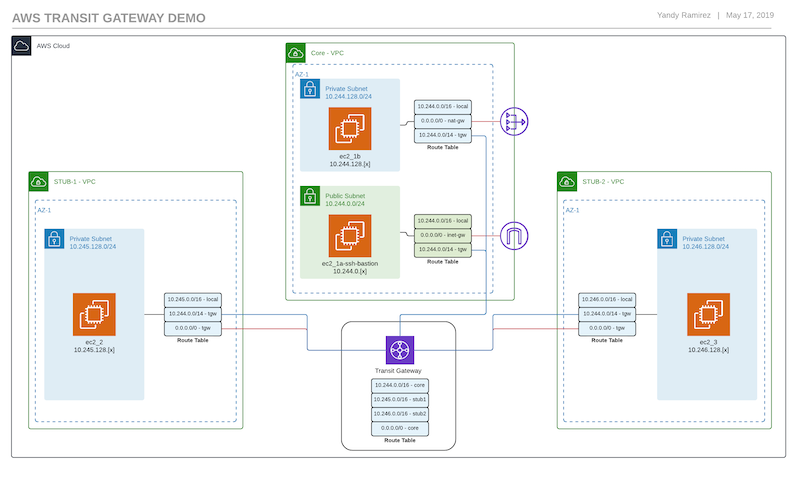

This deploys the infrastructure depicted in this diagram.

[](images/aws-transit-gateway-demo.png)

## Terraform

Make sure you have `Terraform version 0.12.[x]` installed, at the time of this writting `0.12` is at release candidate 1. You need to have a `terraform.tfvars` or `*.auto.tfvars` file with the following keys set...

```hcl
domain_name = "YOUR-DOMAIN-NAME"
ssh_key_name = "AWS-SSH-KEY" # this key needs to exist in the AWS console
self_public_ip = "your-public-ip" # this is used for the security group rule to allow SSH
```

These variables can also be passed in at `apply` or `plan` time with the command `terraform apply -var 'domain_name=test.domain`.

## Deploy

Make sure you have an AWS environment setup, the AWS CLI configured or environment variables with appropriate keys.

### Clone

`git clone https://github.com/IPyandy/aws-transit-gateway-demo.git`

### Plan and Deploy

```shell
cd aws-transit-gateway-demo

terraform init
terraform plan -o plan.tfplan
terraform apply plan.tfplan
```
